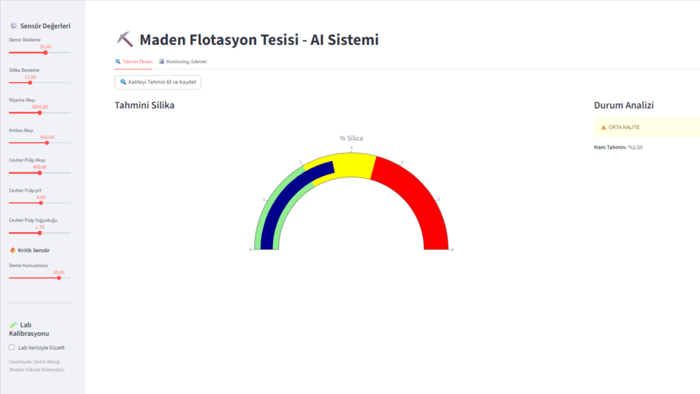
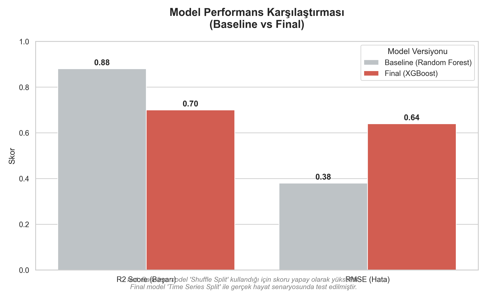

# ⛏️ Mining Quality Prediction: End-to-End ML Project
# ⛏️ Mining Quality Prediction

[](BURAYA_STREAMLIT_LINKINI_YAPISTIR)

🚀 **Canlı Demo:** [Uygulamayı Kullanmak İçin Tıklayın](https://multigroupminingqualitypediction.streamlit.app/)
Bu proje, gerçek bir maden zenginleştirme (flotasyon) tesisinden alınan sensör verilerini kullanarak, üretim kalitesini belirleyen **% Silika (Safsızlık)** oranını tahmin eden uçtan uca bir makine öğrenmesi çözümüdür.


## 📸 Proje Önizlemesi
*(Uygulama ekran görüntüsünü reports klasörüne 'app_screenshot.png' olarak eklediyseniz burada görünür)*


## 🎯 Problem Tanımı ve Çözüm
**Problem:** Flotasyon tesislerinde ürün kalitesi (Silika oranı) laboratuvar analizleriyle belirlenir. Ancak bu analizler **2-4 saat** sürer. Bu gecikme, prosesin geç optimize edilmesine ve hatalı üretime neden olur.

**Çözüm:** Geliştirdiğimiz **XGBoost** modeli, tesisin sensör verilerini (Hava akışı, Pülp yoğunluğu, Demir beslemesi vb.) anlık olarak analiz eder ve kaliteyi **saniyeler içinde** tahmin eder. Ayrıca **"Human-in-the-loop"** yaklaşımıyla, laboratuvardan gelen yeni sonuçlarla model anlık olarak kalibre edilebilir.

## 📊 Veri Seti
* **Kaynak:** [Kaggle - Mining Process Flotation Plant Database](https://www.kaggle.com/datasets/edumagalhaes/quality-prediction-in-a-mining-process)
* **Boyut:** 737,453 satır, 24 sütun (Mart 2017 - Eylül 2017 arası).
* **Hedef Değişken:** `% Silica Concentrate` (Minimize edilmesi gereken safsızlık).

> **⚠️ Önemli Not:** Veri seti boyutu (175MB) GitHub sınırlarını aştığı için repoya eklenmemiştir. Projeyi çalıştırmak için veriyi yukarıdaki linkten indirip `data/` klasörüne `MiningProcess_Flotation_Plant_Database.csv` adıyla kaydetmelisiniz.

## 🛠️ Pipeline ve Metodoloji

1. **Preprocessing:** Tarih formatı düzeltildi, virgül ondalık ayracı işlendi.
2. **Feature Engineering:**
   * **Rolling Window:** Sensör gürültüsünü azaltmak için son 5 periyodun ortalaması alındı.
   * **Lag Features:** Tesis içindeki akış gecikmesini modellemek için `Lag1` özellikleri türetildi.
3. **Modelleme:** `RandomForest` (Baseline) ve `XGBoost` (Final) modelleri kuruldu.
4. **Optimizasyon:** `Optuna` ile hiperparametre optimizasyonu yapıldı.
5. **Deployment:** Model `Streamlit` ile canlıya alındı ve Lab Kalibrasyon özelliği eklendi.

## 📈 Model Performansı

Aşağıdaki grafik, Baseline ve Final model arasındaki performans farkını göstermektedir:



| Model | Validasyon Yöntemi | R2 Score | RMSE | Yorum |
|-------|--------------------|----------|------|-------|
| **Baseline (RF)** | Shuffle Split | 0.88 | 0.38 | ⚠️ **Data Leakage:** Rastgele karıştırma nedeniyle model geleceği görmüştür. |
| **Final (XGBoost)** | **Time Series Split** | **0.70** | **0.64** | ✅ **Gerçekçi:** Zaman serisine sadık kalınarak test edilmiştir. Endüstriyel standartlarda güvenilirdir. |

## 🧠 Açıklanabilirlik ve İş Etkisi
**SHAP Analizi** sonuçlarına göre kaliteyi etkileyen en kritik faktör **Demir Konsantresi (Iron Concentrate)** seviyesidir.
* **Bulgu:** Demir konsantrasyonu düştüğünde, safsızlık (Silika) artmakta ve kalite bozulmaktadır.
* **Lab Entegrasyonu:** Uygulamaya eklenen **Bias Correction** özelliği sayesinde, operatör son laboratuvar sonucunu sisteme girerek modelin tahminlerini anlık olarak düzeltebilir.

## 🚀 Kurulum ve Çalıştırma

**1. Repoyu Klonlayın:**
```bash
git clone [https://github.com/KULLANICI_ADINIZ/mining-quality-prediction.git](https://github.com/KULLANICI_ADINIZ/mining-quality-prediction.git)
cd mining-quality-prediction
2. Sanal Ortam Kurun ve Kütüphaneleri Yükleyin:

Bash

pip install -r requirements.txt
3. Pipeline'ı Çalıştırın (Model Eğitimi): (Veri setini data/ klasörüne koyduğunuzdan emin olun)

Bash

python src/pipeline.py
4. Performans Grafiğini Üretin (Opsiyonel):

Bash

python src/visualize_metrics.py
5. Arayüzü Başlatın:

Bash

streamlit run app.py
📂 Repo Yapısı
mining-quality-prediction/
├── data/               # Ham veri dosyası (Git-ignore edilmiştir)
├── notebooks/          # Jupyter Notebooks (EDA, Baseline, Optimizasyon, Eval)
├── src/                # Kaynak kodlar
│   ├── pipeline.py     # Final eğitim scripti
│   └── visualize_metrics.py # Rapor grafikleri üreteci
├── models/             # Eğitilmiş model dosyaları (.pkl)
├── reports/            # Raporlar ve Grafikler
│   └── performance_comparison.png
├── app.py              # Streamlit web arayüzü (Lab entegrasyonlu)
├── requirements.txt    # Proje bağımlılıkları
├── LICENSE             # MIT Lisansı
└── README.md           # Proje dokümantasyonu
📞 İletişim
Bu verimlilik aracı Sedat Akdağ (Maden Yüksek Mühendisi) tarafından MultiGroup Zero2End Machine Learning Bootcamp kapsamında hazırlanmıştır.